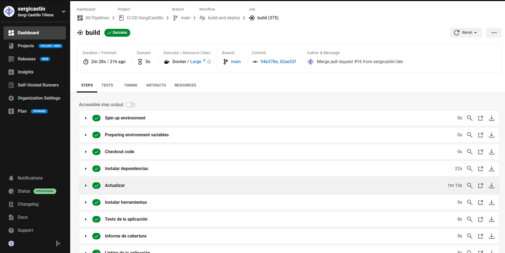
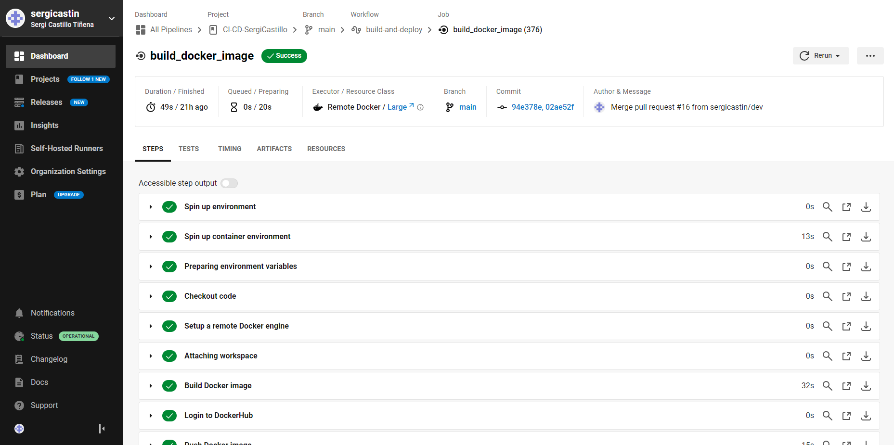
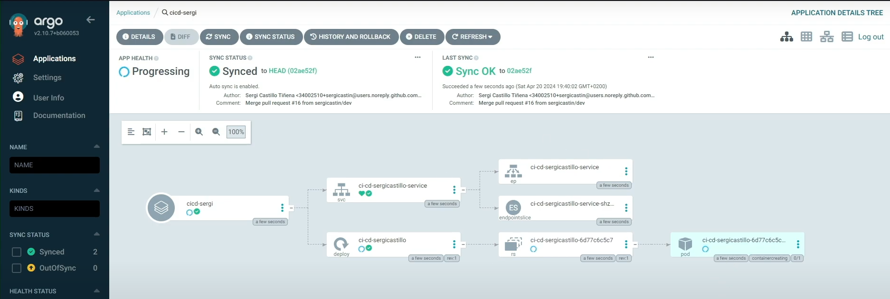
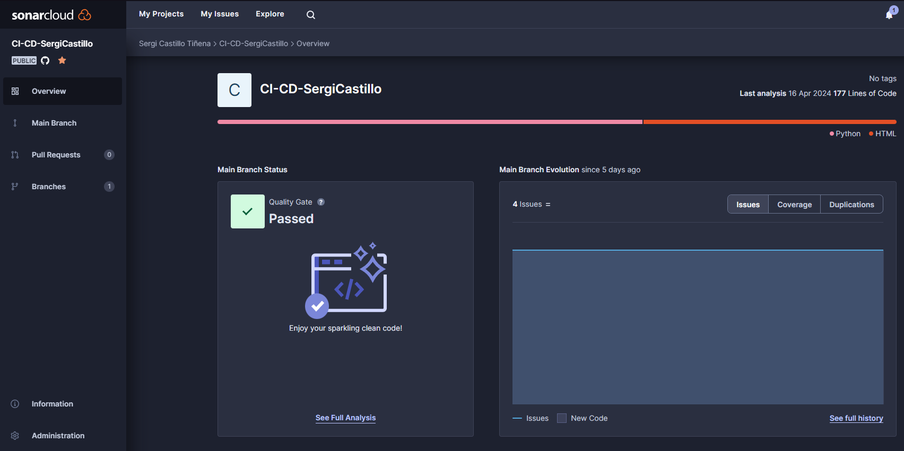
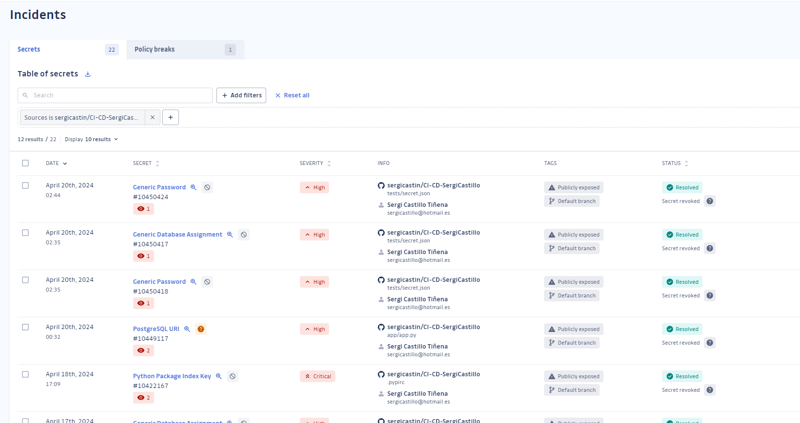

# CI-CD-SergiCastillo

Este repositorio contiene el código fuente y los recursos relacionados con el pipeline de CI/CD y el despliegue de la aplicación.

## Aplicación
La aplicación se encuentra en la carpeta `app`.

## Repositorio de Artefactos
El repositorio de artefactos está alojado en PyPI. Puedes encontrar los artefactos en [CI-CD-SergiCastillo 0.3.1](https://pypi.org/project/CI-CD-SergiCastillo/0.3.1/).

## Configuración del Pipeline de CI/CD
El archivo de configuración para el pipeline de CI/CD se encuentra en `.circleci/config.yml`.

## Recursos
- **CircleCI:**
  - Tests

    
  - Construcción imagen docker
  
    

- **Manifestos de Kubernetes:**
  - Los manifestos para Kubernetes se encuentran en la carpeta `k8s`.

- **Aplicación Desplegada:**
  

- **Proyecto en ArgoCD:**
  

- **Proyecto en SonarCloud:**
  
  - Enlace: [SonarCloud](https://sonarcloud.io/project/overview?id=sergicastin_CI-CD-SergiCastillo)

- **Proyecto en GitGuardian:**
  
  - Enlace: [GitGuardian](https://dashboard.gitguardian.com/workspace/529284/incidents/secrets?source=13703487&start=null&end=null&sort_date=true)

## Video en YouTube
- Tutorial en Video: [YouTube](https://www.youtube.com/watch?v=Mu9NnhSR9CA)

## Contacto
Para más información o cualquier duda, contáctame en sergicastillo@hotmail.es
